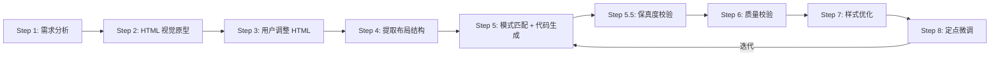

# Qt Widget UI 设计器 + 样式优化 Skill

## 核心功能

1. **HTML 视觉原型** — 用 HTML/CSS 快速表达布局，浏览器即时预览
2. **设计模式库** — 8 种核心 UI 模式，覆盖常见场景
3. **规范代码生成** — HTML 布局 + Qt 模式 → 符合架构规范的 C++ 代码
4. **QSS 样式系统** — 主题管理器、深色/浅色主题、自定义控件样式
5. **动画效果** — 属性动画、过渡效果、高 DPI 适配
6. **质量校验** — 生成后按清单自查
7. **定点微调** — 最小改动原则，精准调整

## When NOT to use

本 Skill 不适用以下场景：

- 项目要求沿用 Qt Designer `.ui` 文件并直接加载，不走纯代码 UI 流程。
- 需要复杂 3D、图表或 Web 内容（考虑 QML / Qt Quick / WebEngine）。
- 仅需简单样式微调，不需要完整的 HTML 原型 → Qt 代码流程。

## 工作流程



### Step 1: 需求分析

识别以下信息：
- **组件类型**：对话框 / 面板 / 主窗口 / 自定义控件
- **功能需求**：需要哪些控件、数据输入输出
- **布局约束**：是否需要侧边栏、是否可调整大小、是否需要滚动
- **样式需求**：是否需要主题切换、深色/浅色模式、动画效果

向用户确认组件类型和关键约束，再进入下一步。

### Step 2: 生成 HTML 视觉原型

**前置条件：必须先读取项目 ThemeManager 的色值定义**，确保 HTML 原型使用与 Qt 代码完全一致的颜色。

根据需求生成 HTML/CSS 原型页面，遵循以下约束：

#### 原型可还原性原则

HTML 原型的唯一目标是**指导 Qt Widget 实现**。生成每个元素、每行样式前，先确认：**这个效果在 QWidget + QSS + 标准布局中能否被高度一致地还原？**

- 如果 CSS 属性或 HTML 特性在 Qt 中**无法直接实现**（如 `box-shadow`、`text-shadow`、`opacity`、`linear-gradient`），则**禁止在 HTML 原型中使用**；若需自定义 `paintEvent()`、事件过滤器、`QGraphicsEffect`、平台代码或第三方库，视为**实现成本过高**，必须改用 Qt 可实现的替代方案。
- 原型中的颜色、间距、圆角、边框、字号、布局比例，必须与最终 Qt 代码中的 `ThemeManager`、QSS、`setContentsMargins()`、`setSpacing()`、`setMinimumSize()` 等保持一一对应。
- 原型阶段就要模拟 QWidget 的渲染特征：无 CSS 动画/过渡、无复杂层叠、无 Web 专属特效、控件层级由布局顺序决定。

> 详细禁用清单与替代方案见 `references/html-prototype-guide.md`。

#### 布局约束

1. **只用 flexbox/grid 基础布局**，不用 `float` / `position: absolute`。
2. **只用语义化标签**，避免无意义 div 嵌套。
3. **用 HTML 注释标注 Qt 特殊控件**：
   - `<!-- dock: left/right/top/bottom -->` → QDockWidget
   - `<!-- splitter -->` → QSplitter
   - `<!-- tab-container -->` → QTabWidget
   - `<!-- stacked: page1, page2 -->` → QStackedWidget
   - `<!-- toolbar -->` → QToolBar
4. **不用 CSS 动画/过渡**，动画在 Qt 中用 `QPropertyAnimation` 实现。
5. **允许基础交互 JavaScript** 用于原型演示（Tab 切换、按钮状态、列表选中、模态框等），但不映射到 Qt 代码。详见 `references/html-prototype-guide.md` 第 6 章。

#### 颜色约束

必须使用 ThemeManager 的实际色值作为 CSS 变量，不用通用色值。生成 HTML 前读取项目 `ThemeManager::LoadTheme()` 中的色值定义，并映射为 CSS 变量：

```css
:root {
  --primary: #3b82f6;              /* colors_["primary"] */
  --background: #1a1d23;           /* colors_["background"] */
  --surface: #22262e;              /* colors_["surface"] */
  --surface_variant: #2d323c;      /* colors_["surface_variant"] */
  --on_background: #e0e4ec;        /* colors_["on_background"] */
  --on_surface_secondary: #9ca3b0; /* colors_["on_surface_secondary"] */
  --on_surface_muted: #6b7280;     /* colors_["on_surface_muted"] */
  --error: #ef4444;                /* colors_["error"] */
  --success: #22c55e;              /* colors_["success"] */
  --border: #3a3f4b;               /* colors_["border"] */
  --divider: #2d323c;              /* colors_["divider"] */
  --hover_overlay: #363c48;        /* colors_["hover_overlay"] */
  --selected_bg: #2a3040;          /* colors_["selected_bg"] */
}
```

#### QWidget 风格约束核心原则

HTML 原型必须模拟 QWidget 的渲染特征：

- **每个效果都必须在 QWidget 中有对应实现方案**；否则禁止在 HTML 原型中使用。
- **禁用 CSS 特效**：`box-shadow`、`text-shadow`、`backdrop-filter`、`border-image`、`opacity`、`transform`、`transition/animation`、`filter`、`clip-path`。
- **禁用 Web 布局/层叠特性**：`position: absolute/fixed`、`float`、`z-index`、`::before/::after` 伪元素、复杂 CSS Grid。
- **禁用渐变**：`linear-gradient` / `radial-gradient`，用纯色替代。
- **圆角规则**：推荐 `≤6px`；按钮主操作和卡片容器可放宽至 `8px`，避免 `>12px`。
- **SVG 规则**：HTML 原型不用 SVG；QSS 中仅全局主题文件允许使用 data URI SVG 绘制 checkbox/radio 等系统指示器，动态 `setStyleSheet` 禁用 SVG。
- **边框用实线**：只用 `border: 1px solid #color`，不用虚线/双线/圆角渐变边框。
- **颜色用纯色**，**字体用系统字体**（`Segoe UI`、`Microsoft YaHei` 等），**间距用像素值**（8/12/16px）。
- **模拟 QWidget 尺寸策略**：输入框宽度用 `flex:1` 而非 `width:100%`，按钮用 `min-width` 而非 `width`。
- **特殊效果用注释标注**：`<!-- scroll-area -->`、`<!-- scaled-contents -->`、`<!-- elided-label -->`、`<!-- splitter -->`。

转换时 CSS 变量必须替换为 ThemeManager 的实际色值，QSS 不支持变量。

> 详细对照表见 `references/html-prototype-guide.md`。

### Step 3: 用户调整 HTML

用户在浏览器中查看原型，提出调整意见。AI 按以下方式处理：

- 布局调整 → 修改 flex 方向/比例
- 尺寸调整 → 修改 width/height/flex
- 增删元素 → 添加/移除 HTML 元素
- 间距调整 → 修改 gap/padding/margin

**迭代直到用户对布局满意。**

### Step 4: 提取布局结构

从 HTML 中提取布局信息：
- 布局方向（垂直/水平/网格/表单）
- 比例关系（flex 值 → stretch factor）
- 分组关系（card → QGroupBox, nav+main → QSplitter）
- 特殊控件标注（dock/splitter/tab/stacked/toolbar）

> 详见 `references/html-qt-mapping.md`

### Step 5: 模式匹配 + 代码生成

1. 根据组件类型和布局结构，从模式库中选择最匹配的设计模式
2. 结合 HTML 布局信息和模式模板，生成 C++ 代码

**代码生成约定**：
- 头文件守卫用 `#pragma once`
- 类命名：XxxDialog / XxxPanel / XxxWidget
- 成员变量：`snake_case_` 尾下划线（与 qt-widget-architecture 规范一致）
- UI 初始化放在 `setupUi()` 私有方法中
- 信号槽连接放在 `connectSignals()` 私有方法中
- 使用新式 connect 语法
- 不混合业务逻辑——UI 类只管布局和交互转发

**子组件映射核心原则**：

- 逐元素扫描 HTML 原型，每个视觉元素都必须映射到对应的 Qt 控件和 QSS 规则。
- 样式属性（background、color、border、border-radius、font、padding、margin、gap、尺寸）需完整映射到 QSS 或布局参数。
- 复合控件内部每个子元素、滚动条、圆角容器子控件配合、QFrame 边框统一等细节，按 `references/html-qt-mapping.md` 执行。

**QWidget 最佳实践核心原则**：

- **样式表性能**：优先使用 `#objectName` 选择器；在根容器集中设置；避免在循环或运行时频繁调用 `setStyleSheet()`。
- **布局性能**：布局嵌套不超过 3 层；始终使用布局管理器；`QScrollArea` 必须 `setWidgetResizable(true)`。
- **控件选择**：只读文本用 QLabel；简单输入用 QLineEdit；静态列表用 QListWidget。
- **内存与信号槽**：控件指定 parent 或加入布局；避免信号循环；批量更新时用 `blockSignals(true/false)`。

> 完整规则与模板见 `references/html-qt-mapping.md` 和 `references/widget-patterns.md`

### Step 5.5: 保真度校验（HTML → Qt 视觉一致性）

代码生成后、质量校验前，逐项检查 HTML 原型与 Qt 代码的视觉一致性，防止“原型好看但 Qt 渲染走样”。覆盖布局边距、`:hover`/`WA_Hover`、属性选择器、`QLabel` 小元素尺寸、分隔线、颜色来源、背景色、字号等 10 条规则。详见 `references/html-qt-fidelity.md`。

### Step 6: 质量校验

生成代码后，按 `references/quality-checklist.md` 逐项自查，覆盖布局合理性、模式一致性、代码质量（`setupUi()`/`connectSignals()` 分离、无业务逻辑、命名规范、新式 connect）、可维护性、样式质量与 HTML → Qt 保真度。

### Step 7: 样式优化

代码生成后，根据用户的样式需求进行视觉优化。

#### 7.1 主题系统

当项目需要深色/浅色主题切换时，提供 ThemeManager 单例：

```cpp
// ui/style/ThemeManager.h
#pragma once
#include <QObject>
#include <QColor>
#include <QHash>

class ThemeManager : public QObject {
    Q_OBJECT
public:
    enum class Theme { Light, Dark, System };
    Q_ENUM(Theme)
    static ThemeManager* Instance();
    void SetTheme(Theme theme);
    Theme CurrentTheme() const;
    QColor ThemeColor(const QString& name) const;
    QColor PrimaryColor() const;
    QColor BackgroundColor() const;
    QColor SurfaceColor() const;
signals:
    void ThemeChanged(Theme theme);
private:
    explicit ThemeManager(QObject* parent = nullptr);
    void LoadTheme(Theme theme);
    void ApplyStylesheet();
    Theme current_theme_ = Theme::Light;
    QHash<QString, QColor> colors_;
};
```

**主题色板**（Material Design 风格）：

| 角色 | 浅色模式 | 深色模式 |
|------|---------|---------|
| primary | #6200EE | #BB86FC |
| secondary | #03DAC6 | #03DAC6 |
| background | #FFFFFF | #121212 |
| surface | #FFFFFF | #1E1E1E |
| error | #B00020 | #CF6679 |
| onPrimary | #FFFFFF | #000000 |
| onBackground | #000000 | #FFFFFF |
| onSurface | #000000 | #FFFFFF |

> 主题文件中的硬编码色值仅作为 ThemeManager 的静态输出参考，实际项目应通过 `ThemeManager::LoadTheme()` 动态注入。
>
> 完整主题文件见 `references/themes/modern-dark.qss` 和 `references/themes/modern-light.qss`

#### 7.2 QSS 样式编写

样式表编写遵循以下规则：

1. **选择器优先级**：`#objectName` > `.className` > `QObject::className` > 后代选择器
2. **集中设置**：在根容器 `setStyleSheet()` 一次性设置，利用 CSS 继承
3. **运行时切换**：用 `setProperty()` + `style()->unpolish()/polish()` 而非重新 `setStyleSheet()`
4. **性能禁忌**：不用后代选择器链、不在循环中调用 setStyleSheet、不用 QSS 渐变

```cpp
// ✅ 高性能：ID 选择器 + 根容器集中设置
void StatusPanel::setupUi() {
    setObjectName("statusPanel");
    setStyleSheet(R"(
        #statusPanel { background-color: #1e1e1e; }
        #fieldLabel { color: #9ca3b0; font-size: 12px; }
        #valueLabel { color: #ffffff; font-size: 20px; font-weight: bold; }
    )");
}

// ✅ 运行时样式切换
void StatusPanel::UpdateStatus(bool running) {
    auto* label = value_labels_["status"];
    label->setProperty("statusClass", running ? "running" : "stopped");
    label->style()->unpolish(label);
    label->style()->polish(label);
}
```

> 完整 QSS 属性参考见 `references/qss-reference.md`

#### 7.3 自定义控件样式

当标准 QSS 无法满足视觉需求时，通过 `paintEvent()` 自定义绘制：

> **阴影实现方式选择**：
> - **QPainter 手绘**（推荐）：性能好，完全控制渲染，适合大量卡片场景
> - **QGraphicsDropShadowEffect**：实现简单，但性能开销较大，适合少量卡片或静态布局

```cpp
// ui/widgets/CardWidget.h
class CardWidget : public QFrame {
    Q_OBJECT
    Q_PROPERTY(int elevation READ Elevation WRITE SetElevation)
public:
    explicit CardWidget(QWidget* parent = nullptr);
    int Elevation() const { return elevation_; }
    void SetElevation(int elevation);
protected:
    void paintEvent(QPaintEvent* event) override;
private:
    int elevation_ = 1;
};
```

```cpp
// ui/widgets/CardWidget.cpp
void CardWidget::paintEvent(QPaintEvent* event) {
    QPainter painter(this);
    painter.setRenderHint(QPainter::Antialiasing);
    if (elevation_ > 0) {
        QColor shadow_color(0, 0, 0, 30 + elevation_ * 10);
        painter.setPen(Qt::NoPen);
        painter.setBrush(shadow_color);
        painter.drawRoundedRect(rect().adjusted(2, 2, -2, -2), 8, 8);
    }
    painter.setBrush(ThemeManager::Instance()->SurfaceColor());
    painter.setPen(QPen(ThemeManager::Instance()->ThemeColor("divider"), 1));
    painter.drawRoundedRect(rect().adjusted(0, 0, -4, -4), 8, 8);
}
```

> 更多自定义控件样式见 `references/custom-widgets.md`

#### 7.4 动画效果

使用 QPropertyAnimation 实现动画，**不用 CSS 动画/过渡**：

```cpp
// ui/animation/AnimationUtils.h
class AnimationUtils {
public:
    static QPropertyAnimation* FadeIn(QWidget* widget, int duration = 300);
    static QPropertyAnimation* FadeOut(QWidget* widget, int duration = 300);
    static QPropertyAnimation* SlideIn(QWidget* widget, Qt::Edge from, int duration = 300);
    static QPropertyAnimation* Scale(QWidget* widget, qreal from, qreal to, int duration = 200);
};
```

**动画使用原则**：
1. 动画持续时间 200-400ms，不超过 500ms
2. 使用 `QEasingCurve::InOutQuad` 缓动曲线
3. 动画对象指定 parent 或连接 `finished` → `deleteLater`
4. 不在动画回调中做耗时操作

> 完整动画模式库见 `references/animation-patterns.md`

#### 7.5 高 DPI 适配

Qt 5 项目需要在 `main()` 中启用 `Qt::AA_EnableHighDpiScaling`（Qt 5.6+），Qt 6 已默认处理高 DPI 缩放。跨版本代码可用条件编译兼容：

```cpp
#if QT_VERSION < QT_VERSION_CHECK(6, 0, 0)
    QApplication::setAttribute(Qt::AA_EnableHighDpiScaling);
#endif
```

**高 DPI 注意事项**：
1. 图标和图片提供 `@2x` / `@3x` 版本
2. 不用固定像素尺寸，用 `minimumSize` + `sizePolicy`
3. QSS 中的 `px` 值会被 Qt 自动缩放
4. 自定义 `paintEvent()` 中使用 `devicePixelRatio()` 处理位图

### Step 8: 定点微调

用户对 C++ 代码提出调整意见时，按以下流程处理：

1. **解析反馈**：判断属于哪类调整
2. **定位代码**：找到需要修改的成员变量和 `setupUi()` 中的对应代码行
3. **制定改动方案**：列出需要修改的具体位置和内容（不超过 3 处）
4. **执行修改**：用 Edit 工具定点修改，不重写整个文件
5. **局部校验**：只校验受影响的校验项
6. **简要说明**：告诉用户改了什么、为什么这样改

**调整类型**：

| 调整类型 | 调整策略 |
|---------|---------|
| 布局调整 | 修改 stretch/调换控件顺序/更换布局类型 |
| 尺寸调整 | 修改 minimumSize/sizePolicy/stretch |
| 增删控件 | insertWidget/removeWidget |
| 控件替换 | 替换控件类型，保持布局位置和信号不变 |
| 间距调整 | 修改 spacing/contentsMargins/addStretch |
| 结构重组 | 提取子 Widget/包裹 QGroupBox |
| 样式调整 | 修改 QSS 属性/切换 property class/调整 ThemeManager 色板 |
| 动画调整 | 修改 duration/easing curve/添加或移除动画 |
**调整原则**：最小改动、定位精准、校验局部
**迭代终止**：用户满意 / 用户提出新需求 / 超过 5 轮（建议重新审视需求）

---

## 与其他 Skills 的协作

- 生成 UI 代码时遵循 **qt-widget-architecture** 的分层规范（UI 类不包含业务逻辑）
- 视觉样式专项优化可协同 **qt-widget-style-optimizer**
- 代码审查引导用户使用 **qt-cpp-review**

---

## 参考资源

| 主题 | 参考文件 |
|------|----------|
| HTML→Qt 保真度规则 | `references/html-qt-fidelity.md` |
| HTML 原型指南 | `references/html-prototype-guide.md` |
| HTML→Qt 映射 | `references/html-qt-mapping.md` |
| 布局规则 | `references/layout-rules.md` |
| 控件模式 | `references/widget-patterns.md` |
| 对话框模板 | `references/dialog-templates.md` |
| 面板模板 | `references/panel-templates.md` |
| 主窗口模板 | `references/mainwindow-templates.md` |
| 自定义控件模板 | `references/custom-widget-templates.md` |
| 质量校验清单 | `references/quality-checklist.md` |
| QSS 属性参考 | `references/qss-reference.md` |
| 自定义控件样式 | `references/custom-widgets.md` |
| 动画模式库 | `references/animation-patterns.md` |
| 深色主题 | `references/themes/modern-dark.qss` |
| 浅色主题 | `references/themes/modern-light.qss` |
